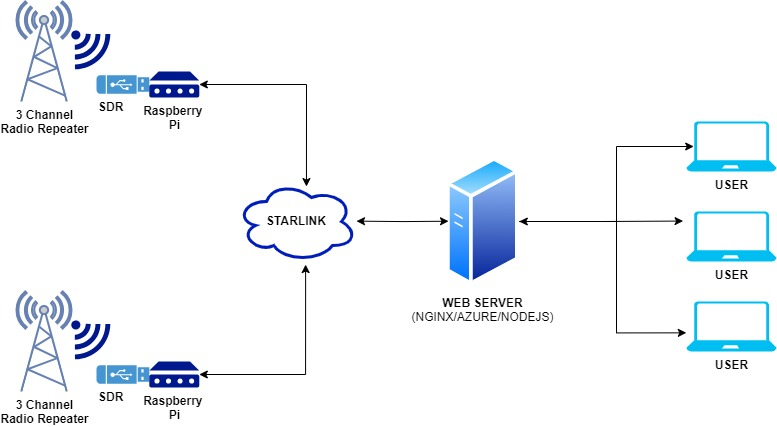

# CITS3200-Project

Quick-access hyperlinks:

- [JIRA Board](https://cits3200team5.atlassian.net/jira/software/projects/SCRUM/boards/1)
- [Project Outline](https://uniwa-my.sharepoint.com/:w:/r/personal/23408841_student_uwa_edu_au/_layouts/15/Doc.aspx?sourcedoc=%7B5D3EBC7B-4245-4875-B1CF-AA6C431C241A%7D&file=CITS3200%20-%20Radio%20Project.docx&action=default&mobileredirect=true)

| UWA ID   | Name           | Github Username |
| -------- | -------------- | --------------- |
| 23455873 | Aifert Yet     | Aifert          |
| 23408841 | Arnav Dangmali | GravityWorld    |
| 23012728 | Henry Hewgill  | HenryHewgill    |
| 22705919 | Jakem Pinchin  | JakePinchin     |
| 23334811 | Joseph Newman  | RedBlueCarrots  |
| 23165388 | Sigmund Howe   | SigHowe         |

---

### Scope
The Remote Radio Monitoring Solution (RRMS) is for DFES to access radio streams and analytics from a web browser.
### Architecture Overview


## Getting Started / Installation Guide

### Prerequisites (for your local machine)
- Docker

For hosting on your own web server
- Virtual Machine
- Nginx on your Virtual Machine

1. **Clone the Respository**:
```bash
git clone https://github.com/GravityWorld/CITS3200-Project.git

cd CITS3200-Project
```

2. **Start up Docker**

**Make sure you have Docker Desktop Installed**

- MAC - https://docs.docker.com/desktop/install/mac-install/
- Windows - https://docs.docker.com/desktop/install/windows-install/
- Linux - https://docs.docker.com/desktop/install/linux-install/

Before continuing make sure the docker desktop you've downloaded is running, run it by double clicking on it.

If you are using WSL on windows, activate WSL by doing in terminal

```bash
wsl
```

Then

(For development)
```bash
docker-compose -f docker-compose.dev.yml up --build
```

## Environment Variables

If you want to set up CI/CD before starting update copy the `env.default` file and update accordingly
```bash
sudo cp .env.default .env
sudo nano .env
```

To run a front-end, you will also need to update a `.env.local.default` file in frontend directory
```bash
AZURE_AD_CLIENT_ID=***
AZURE_AD_CLIENT_SECRET=***
AZURE_AD_TENANT_ID=***
NEXTAUTH_SECRET=***
NEXTAUTH_URL=***
NEXT_PUBLIC_BACKEND_URL=***
NEXT_PUBLIC_SDR_URL=***
```

Sample request you can make to interact with webserver

```https://cits3200-d5bhb7d7gaeqg2b0.australiacentral-01.azurewebsites.net```

```https://cits3200-d5bhb7d7gaeqg2b0.australiacentral-01.azurewebsites.net/login```


### All additional documentation are located in [README](./README/) directory

### NodeJS Unit Testing

Unit testing has been set up in NodeJS using jest

Unit tests can be run simply with

```bash
npm test
```
