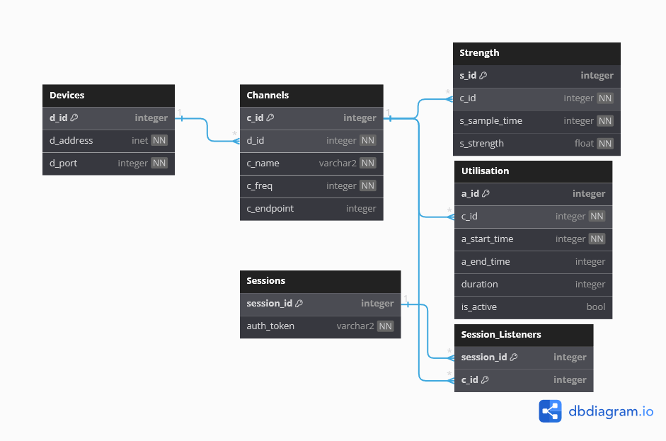

# CITS3200-Project Database

## Database Schema Diagram

This diagram was generated using [database markup](https://github.com/Aifert/CITS3200-Project/blob/main/webserver/database/RRMS_webserver.dbml)

## Database Explaination
The database is hosted in Postgres, and connected to by the psql library in NodeJS.
All tables are held in the database mydb.
Other databases (such as testdbi and tesdbmu) are only intended for use in unit tests

A local database instance can be created using docker-compose build ([see repo README](https://github.com/Aifert/CITS3200-Project/blob/main/README.md))
Once built, it can be connected to with `psql -U user -d mydb`

### Devices
Each verified raspberry pi device will provide its own d_id (created on device using the device's MAC address), and store its address and port in case the database needs to send something to the device

### Channels
Each channel is stored with the device it is on, a human readable name, and the frequency associated with it

### Strength
Stores a timestamped record of a peak strength value on a specific channel

### Utilisation
Will store ordered pairs of start and end times for a period of usage. If end time is null, it mans the channel is still in use. The columns duration and is_active are unsused (now calculated by the web server)

### Sessions & Session Listeners
Are both tables no longer in use.

## Database Santitation
Currently all tables are kept logically correct using a script run within the middleware [See here](https://github.com/Aifert/CITS3200-Project/blob/main/backend/model_utils.js#L537)
The logic used is:
 - Ensure only the latest utilisation pair is still active
 - Ensure all timestamps come before the current time
 - Ensure any offline channels are not still reporting utilisation
